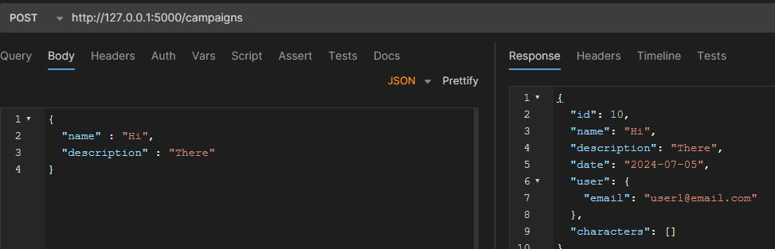
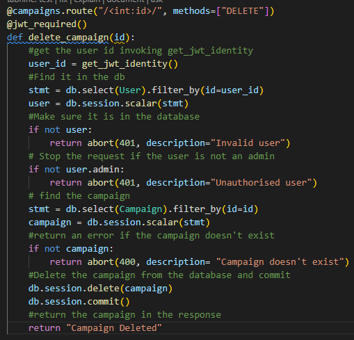

# Dnd Profile Manager

### Link to GitHub Repository

https://github.com/hynguyenduc/T2A2-API-Webserver-Project

## R1
#### The Problem 
Dnd was initially a pen and paper game that encouraged getting together with a group of friends and exploring fantasy worlds. Now, with modern day technologies, we are able to connect with many different groups of people and discover new adventures. However, as we grow old it becomes harder to manage our time and maintain consistent connection with all the new friendships we started and campaigns we have embarked on. This can lead to lost character sheets or mixing up our characters.

#### The Solution
My proposed solution is a web database that can hold all relevant information for users, their campaigns and the character they have created

## R2
Tasks are tracked with trello. The workload will be separated by sections and will be placed into 3 possible conditions: Initially tasks start in their respective section, then progress to a 'Working on' column then move onto a 'Finished' column. There was also daily stand-up reports on the class discord. 
##### Planning Phase

- Mainly listing out the task to do
##### Day 1

- Start with initializing the project, setting it up before any real coding
##### Day 2

- Create the models and the schema coding and planning how they interact with each other
##### Day 3

- Testing the models and schema with a cli command that should create the tables and fill them automatically with sample data
##### Day 4

- Creating the query routes
##### Day 5

- Creating error handlers to handle errors I have encountered and finishing off the documentation

## R3
3rd party python libraries and dependencies would include
#### Flask: 
Python library that serves as a "web framework", a tool for making web applications

#### Marshmallow: 
Package that converts complex SQLAlchemy models to Python data types, such as dicts (serialization) and converts dicts to SQLAlchemy models (deserialization). Flask-marshmallow is the interface that connects Flask to Marshmallow  

#### SQLalchemy: 
An ORM (Object Relational Mapping) that facilitates interaction between a database and a Flask built python application. It does this by mapping database schema (tables) and data to Python objects. Overall,  SQLAlchemy provides less and cleaner code compared to embedded SQL, allowing for ease of use and maintenance.

#### Bcrypt: 
Adds another layer of password protection with a technique called Hashing. Define hashing????

#### Psycopg2: 
Popular Postgresql database adapter for Python

#### Werkzeug: 
Sub-package of Flask used here to handle BadRequest errors. 

#### Flask-jwt-extended: 
Allows the web server to create and interpret a JWT token to allow for greater security with Bearer-type authentication (via encryption)

## R4
For this project, I have used PostgreSQL, a relational database management system (RDBMS).
The benefits of PostgreSQL and relational databases include:

* Structured Data Model: Relational databases enforce a structured approach to storing data, which helps ensure data integrity and consistency.

* Strong Consistency: RDBMS systems maintain strong consistency guarantees, meaning that once a transaction is committed, data is immediately and durably stored in a consistent state.

* Standardized Query Language (SQL): SQL is well-defined and widely supported across various relational databases, making it easier to learn and use compared to proprietary query languages.

* Data Integrity: Built-in constraints (such as foreign keys, unique constraints, etc.) ensure data integrity at the database level, preventing inconsistencies.

* Scalability: While traditionally thought to be less scalable than NoSQL databases, modern RDBMS like PostgreSQL have improved scalability features like partitioning, replication, and clustering.

* Community and Support: PostgreSQL has a large and active open-source community, providing extensive documentation, support forums, and third-party tools.

In contrast, these are the downsides of PostgreSQL and RDBMS in General:

* Scaling Limitations: While PostgreSQL and other RDBMS can scale vertically (by adding more resources to a single server), scaling horizontally across multiple servers can be more complex and may require careful architecture and setup.

* Schema Modifications: Altering the database schema in a live production environment can sometimes be challenging and requires careful planning to avoid downtime or data loss.

* Flexibility vs. Structure: The structured nature of RDBMS can sometimes be seen as a limitation when dealing with highly variable or rapidly changing data structures, where NoSQL databases might offer more flexibility.

* Learning Curve: While SQL is standardized, mastering the intricacies of relational databases, including normalization, indexing, and query optimization, can require significant learning and experience.

In summary, PostgreSQL is a powerful and versatile database system with advanced features, scalability, and reliability. However, it comes with complexities that need to be addressed when deploying and managing PostgreSQL in production environments. Overall, PostgreSQL is well-suited for medium to large-scale API projects that require a robust and feature-rich database solution.

## R5
SQLAlchemy is a popular Python SQL toolkit and Object-Relational Mapping (ORM) library that provides a flexible and high-level interface for interacting with relational databases.

Firstly, it allows developers to define database models as Python classes (objects). These classes represent tables in the database, where attributes of the class correspond to columns in the table.
By using ORM, developers can work with database records as Python objects, abstracting away much of the SQL syntax and database-specific details.

Secondly, the toolkit offers support for multiple database backends including PostgreSQL, MySQL, SQLite, Oracle, and more. It provides a consistent API regardless of the underlying database, allowing developers to switch databases easily.

SQLAlchemy also allows users to write SQL queries using Python by using Python constructs rather than raw SQL strings. This makes it easier to dynamically construct SQL queries with Python for complex database operations.

The main purpose for choosing SQLAlchemy is its ability to be used with web frameworks, mainly Flask, integrating seamlessly with these frameworks to provide database support and ORM capabilities.

Key Features of SQLAlchemy:

Declarative Syntax: SQLAlchemy allows developers to define database models using a declarative syntax, where Python classes map directly to database tables and columns.

Session Management: SQLAlchemy manages database sessions, providing a unit of work pattern where changes to objects are tracked and committed to the database in a transactional manner.

Relationship Management: SQLAlchemy supports relationships between database tables, including one-to-one, one-to-many, and many-to-many relationships. These are defined using object attributes, facilitating data retrieval and manipulation.

Query Optimization: SQLAlchemy includes tools for query optimization and performance tuning, allowing developers to fine-tune database queries to improve application performance.

## R6

User will represent the account user, therefore required authentication and authorization details like password and admin. This will be represented by a user_id number. 
Users can then create campaigns that host characters. Campaigns simply need name of the campaign, a description of the adventure and a date will be generated on creation. It shares a one to many relationship with user, therefore need a foreign key from user_id. Characters is the last parameter. It contains name, race and class of the character and a date will be generated on creation. A character is attached to a campaign and user so it requires a foreign key from user_id and campaign_id. This means when a user is deleted, both campaign details and character details will be as well. In addition, if campaigns are deleted, only the character details will be removed as well, to prevent orphan data.

## R7
Some changes to the initial design include spreading out the stats into individual values so that they could be added a table. Users are the root model to which users can create their own campaigns. Afterwards, the campaign creator and the other users can add their player characters to any particular campaign. It was done this way for ease of coding the delete methods, as a deleted User would removed all the campaigns they created and were dungeon-mastering for and therefore the related player character data could be removed as well. 

## R8
#### Register user/account 

- The route is "/auth/register" and it used a GET request to register new users
- Takes a request that contains email and password, while ignoring any other parameters
- It returns the request with an encrypted JWT 'token' for authenticating requests that need it, essentially logging in the new user after they make a new account

#### Login with existing users

- The route is "/auth/login" and this one alse uses a GET request to login existing users
- Takes a request that contains email and password, while ignoring any other parameters
- It returns the request with an encrypted JWT 'token' for authenticating requests that need it

#### Read data on existing campaigns

- There are two routes: The route for requesting information on one campaign is "/campaigns/'corresponding id'/" and the route for requesting information on all campaigns on the database is "/campaigns/" and uses a GET request to retrieve read data presented in JSON format
- Request is done in the url bar and will return campaign details such as name and description, including any attached player characters to that campaign

#### Update info on existing campaigns

- Route is "/campaigns/", but this one uses a PUT request to update the campaign details
- Requires a JWT bearer token
- Takes only relevant parameters, that being "name" and "description", and excludes anything else
- Returning response is the campaign information with the updated campaign details

#### Create a new campaign

- Route is "/campaigns/", but this one uses a POST request to create a new campaign
- Requires a JWT bearer token
- Takes only relevant parameters, that being "name and description", and excludes any unknown ones.
- Returning response would be the campaign information in JSON format

#### Create a new character

- Route is "/campaigns/'related campaign id'/characters and this is a POST request
- Requires a JWT bearer token
- Take relevant parameters such as "name", "race", character class as "char_class" and the 6 individual ability stats
- Returning response contains the parameters the program has received and the email of the user who created it
- Characters can be linked to any user's campaign and not exclusively campaigns they have created themselves

#### Delete a campaign

- Route is "/campaigns/'relevant campaign id'/" and takes in a DELETE request
- Requires a JWT bearer token and admin authorization
- Returns text: "Campaign deleted" otherwise errors will direct the user towards achieving that result
